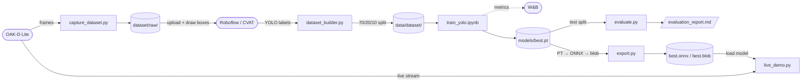
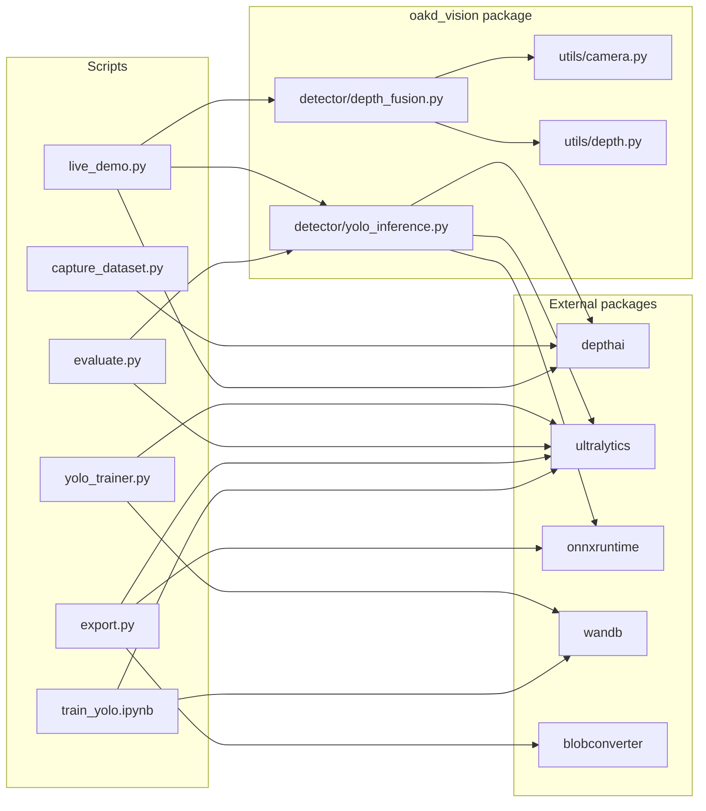

# Education Guide — OAK-D Vision ML

A plain-language walkthrough of every concept and code decision in this project.
No assumed background beyond basic Python and a rough idea of what a neural network is.

---

## Table of Contents

**P1 — YOLO Fine-Tuning + 3D Detection**
0. [File Relationship Diagrams](#0-file-relationship-diagrams)
1. [The Problem We're Solving](#1-the-problem-were-solving)
2. [How YOLO Works](#2-how-yolo-works)
3. [Why Fine-Tuning](#3-why-fine-tuning)
4. [The OAK-D Lite Camera](#4-the-oak-d-lite-camera)
5. [Stereo Depth — How the Camera Sees Distance](#5-stereo-depth--how-the-camera-sees-distance)
6. [The Capture Pipeline](#6-the-capture-pipeline)
7. [Dataset Structure and Splitting](#7-dataset-structure-and-splitting)
8. [Training YOLOv8n](#8-training-yolov8n)
9. [Augmentation — Why We Fake Bad Data](#9-augmentation--why-we-fake-bad-data)
10. [Evaluation Metrics](#10-evaluation-metrics)
11. [Exporting the Model](#11-exporting-the-model)
12. [3D Detection — From Pixels to Real Space](#12-3d-detection--from-pixels-to-real-space)
13. [The Three Inference Backends](#13-the-three-inference-backends)
14. [The Full Pipeline End-to-End](#14-the-full-pipeline-end-to-end)

**P2 — ReID + Multi-Object Tracking**
15. [What P1 Cannot Do — The Identity Problem](#15-what-p1-cannot-do--the-identity-problem)
16. [ReID — Teaching the Model to Recognise Instances](#16-reid--teaching-the-model-to-recognise-instances)
17. [Triplet Loss — How ReID Learns](#17-triplet-loss--how-reid-learns)
18. [DeepSORT — Combining Motion and Appearance](#18-deepsort--combining-motion-and-appearance)
19. [Why Custom Data Instead of Market-1501](#19-why-custom-data-instead-of-market-1501)
20. [How ReID Training Works — Data, Features, Targets](#20-how-reid-training-works--data-features-targets)
21. [Reading ReID Training Results — Overfitting and What to Expect](#21-reading-reid-training-results--overfitting-and-what-to-expect)
22. [P2 and P7 Person Following — Why Tracking Matters](#22-p2-and-p7-person-following--why-tracking-matters)

---

## 0. File Relationship Diagrams

### Diagram 1 — P1 pipeline: from hardware to live demo

Rectangles = scripts/files you work with. Cylinders = data on disk. Rounded = external tools/hardware.



---

### Diagram 2 — module imports: which file depends on which

Arrows mean "imports from". Left = scripts you run. Middle = the `oakd_vision` library. Right = external packages.



### At a glance — what each file is responsible for

| File | Role |
|---|---|
| `scripts/capture_dataset.py` | **Run on laptop + OAK-D.** Interactive capture loop — saves jpg/npy pairs per class |
| `scripts/live_demo.py` | **Run on laptop + OAK-D.** Final demo — streams, detects, overlays 3D positions |
| `capture/oakd_capture.py` | Reusable OAKDCapture class (pipeline builder + frame getter) |
| `capture/dataset_builder.py` | Splits a flat labeled folder into 70/20/10 train/val/test |
| `detector/yolo_trainer.py` | Wraps Ultralytics `model.train()` with CLI args + W&B |
| `detector/evaluate.py` | Runs test-split validation, prints mAP, writes report |
| `detector/export.py` | Chains PT → ONNX → OpenVINO → blob, prints FPS benchmark |
| `detector/yolo_inference.py` | `YOLODetector` — one class, three backends (pytorch/onnx/vpu) |
| `detector/depth_fusion.py` | `DepthFusion` — maps 2D detections to 3D positions via depth |
| `utils/camera.py` | `CameraIntrinsics` — holds lens params, does `pixel_to_3d()` |
| `utils/depth.py` | `get_depth_for_bbox()` — robust depth estimate for a bounding box |
| `training/configs/yolov8n_custom.yaml` | Dataset paths + class names — read by trainer, evaluator |
| `training/notebooks/train_yolo.ipynb` | Self-contained Colab training notebook |

---

## 1. The Problem We're Solving

Off-the-shelf YOLOv8 was trained on **COCO** — 80 classes, 330,000 images, all shot from human-eye height (~1.6m off the ground) by people holding cameras normally.

Our TurtleBot3's OAK-D Lite camera sits **~20cm off the ground**.

The visual difference is enormous:

| COCO sees | Our robot sees |
|---|---|
| A chair from the side at 1m | A chair's legs from below at 0.3m |
| A shoe sitting on a floor | A shoe from 5cm away, filling the frame |
| A mug on a table at eye level | The underside of a mug on a table above |

COCO-pretrained YOLO has never seen these viewpoints. It will miss detections, misclassify objects, and produce unreliable confidence scores.

**Fine-tuning** retrains the model's knowledge on your specific objects at your robot's actual viewpoint, closing that gap.

---

## 2. How YOLO Works

YOLO stands for **You Only Look Once**. The name describes the key idea: instead of scanning an image in multiple passes (like older detectors did), YOLO makes all predictions in a single forward pass through the network.

### The grid concept

YOLO divides the image into a grid of cells. For a 640×640 input with a stride-32 backbone layer, that's a 20×20 grid = 400 cells. Each cell is responsible for predicting objects whose center falls in that cell.

YOLOv8 actually uses **three** grid sizes simultaneously (at different scales) to catch objects of different sizes. This is called the **FPN — Feature Pyramid Network**.

### What the network outputs

For each grid cell at each scale, YOLO predicts:
- `cx, cy` — object center offset from the cell's top-left corner
- `w, h` — object width and height (as fractions of the image)
- `objectness` — is there an object here? (removed in YOLOv8's anchor-free design)
- `class scores` — one score per class (e.g. 0.92 = shoe, 0.04 = mug...)

In YOLOv8, the raw output tensor has shape `[1, 4 + nc, 8400]` where:
- `1` = batch size
- `4` = bounding box (cx, cy, w, h)
- `nc` = number of classes
- `8400` = total anchor points across all three FPN scales (80×80 + 40×40 + 20×20 = 8400)

### NMS — cleaning up duplicates

Multiple nearby cells often predict the same object. **Non-Maximum Suppression (NMS)** removes duplicates: keep the highest-confidence box, discard any other box that overlaps it by more than `iou_threshold` (typically 0.45).

---

## 3. Why Fine-Tuning

Training a detection model from scratch requires millions of images and weeks of compute. Fine-tuning takes a model that already understands the visual world (edges, textures, shapes) and teaches it your specific task.

### What transfer learning actually does

YOLOv8n's backbone (a lightweight C2f architecture) learns **feature extractors** — filters that detect edges, corners, gradients, textures. These are universal and useful for any visual task.

The **head** (the part that predicts boxes and classes) is task-specific. Fine-tuning mostly updates the head while the backbone's features carry over.

Think of it as: the backbone is a trained pair of eyes, the head is a specialized brain. We keep the eyes (they already work), and retrain the brain for our objects.

### YOLOv8n specifically

The "n" suffix means **nano** — the smallest YOLOv8 model:
- 3.2M parameters (vs 68M for YOLOv8x)
- ~8ms inference on a modern CPU
- Designed for edge deployment

This is the right choice for the Myriad X VPU on the OAK-D Lite, which has tight memory constraints.

---

## 4. The OAK-D Lite Camera

The OAK-D Lite has three cameras in one housing:

```
[Left Mono] ---- 7.5cm ---- [Right Mono]
                  |
              [RGB Camera]
```

| Camera | Sensor | Resolution | Purpose |
|---|---|---|---|
| RGB (center) | IMX378 | up to 4056×3040 | Colour frames for detection |
| Left Mono | OV7251 | 640×480 max | Left eye for stereo |
| Right Mono | OV7251 | 640×480 max | Right eye for stereo |

It also has an onboard **Myriad X VPU** (Vision Processing Unit) — a specialised chip for neural network inference, separate from any CPU.

---

## 5. Stereo Depth — How the Camera Sees Distance

Human eyes work exactly like this: two eyes separated by ~6.5cm. Your brain computes depth by comparing how much an object shifts between the left and right view (this shift is called **disparity**).

The OAK-D Lite does the same with its two mono cameras.

### Disparity → Depth formula

```
depth = (focal_length × baseline) / disparity
```

Where:
- `focal_length` = lens focal length in pixels (from calibration)
- `baseline` = physical distance between the two cameras (7.5cm on OAK-D Lite)
- `disparity` = pixel shift between left and right image

A large disparity = object is close. Small disparity = object is far. Zero disparity = object at infinity (or beyond range).

### Why depth values can be invalid (zero)

Some pixels have no valid disparity:
- **Occluded regions** — areas visible in one camera but blocked in the other
- **Textureless surfaces** — white walls, plain floors (no features to match)
- **Specular reflections** — shiny surfaces confuse the matcher
- **Out-of-range** — OAK-D Lite reliably measures ~0.3m to ~10m

This is why [depth.py](oakd_vision/utils/depth.py) filters out zeros and uses a percentile on the inner 50% of the bounding box.

### Depth alignment

By default, stereo depth is computed in the **mono camera frame** — its pixels don't line up with the RGB camera. We call `stereo.setDepthAlign(dai.CameraBoardSocket.CAM_A)` to warp the depth map into the RGB frame, so `depth_map[row][col]` corresponds exactly to `rgb_frame[row][col]`.

---

## 6. The Capture Pipeline

[oakd_capture.py](oakd_vision/capture/oakd_capture.py) builds a **DepthAI pipeline** — a graph of processing nodes that run on the OAK-D device itself.

### What a DepthAI pipeline is

Think of it like a directed graph of operations happening inside the camera:

```
MonoLeft ──┐
           ├──► StereoDepth ──► XLinkOut("depth") ──► [your Python code]
MonoRight ─┘

ColorCamera ──► XLinkOut("rgb") ──► [your Python code]
```

`XLink` is the USB bridge. `XLinkOut` is a node that sends data from the device over USB to your host machine. `XLinkIn` goes the other direction.

### The capture script

[scripts/capture_dataset.py](scripts/capture_dataset.py) wraps this with a simple interactive loop:
- Press `SPACE` to save the current frame pair (`.jpg` + `.npy`)
- Press `Q` to quit
- Numbering resumes from where you left off, so you can capture across multiple sessions

**Bug that was fixed:** The original script was missing `stereo.setDepthAlign(CAM_A)` and the `setBoardSocket` calls on the mono cameras. Without alignment, the depth pixels correspond to the left mono camera's viewpoint, not the RGB camera. Depth values sampled from bounding boxes drawn on the RGB frame would be wrong — they'd be measuring depth at the wrong pixel location.

---

## 7. Dataset Structure and Splitting

### YOLO label format

Each image has a paired `.txt` file. Each line in the `.txt` is one object:

```
<class_id> <cx> <cy> <width> <height>
```

All values are **normalized** (0.0 to 1.0, relative to image dimensions). For example, a shoe whose center is at pixel (320, 240) in a 640×640 image would be `cx=0.5, cy=0.375`.

### The 70/20/10 split

[dataset_builder.py](oakd_vision/capture/dataset_builder.py) randomly shuffles all labeled images and splits them:

| Subset | Fraction | Purpose |
|---|---|---|
| Train | 70% | Images the model learns from |
| Val | 20% | Used during training to check for overfitting after each epoch |
| Test | 10% | Held out completely — only used once, for final reporting |

The test set is the only honest measure of real performance. If you evaluated on the training set, the model would score perfectly because it memorized those images. Keeping the test set hidden prevents you from unconsciously tuning toward it.

### `dataset.yaml`

The YAML tells Ultralytics where to find the images, what the class IDs map to, and how many classes there are. A minimal example:

```yaml
path: data/dataset
train: images/train
val:   images/val
test:  images/test
nc: 8
names: [shoe, mug, bottle, chair, bag, book, laptop, box]
```

---

## 8. Training YOLOv8n

### The Data: Features and Targets

**Input (features):** Each image resized to 640×640 RGB pixels. That's it — just pixel values fed into the network.

**Labels (targets):** For each image, Roboflow generated a `.txt` file with one line per object:

```
2 0.512 0.341 0.124 0.089
│   │     │     │     └─ box height (fraction of image height)
│   │     │     └─ box width (fraction of image width)
│   │     └─ box center Y (fraction of image height)
│   └─ box center X (fraction of image width)
└─ class ID (0=cable, 1=chair_leg, 2=mug, ...)
```

These are the ground truth boxes you drew in Roboflow. The model learns to predict these values from the pixels alone.

### Model Architecture

YOLOv8n has two parts:

**1. Backbone (feature extractor)**
A series of convolutional layers that scan the image and extract features — edges, textures, shapes, object parts. Early layers detect simple things (edges, corners). Deeper layers detect abstract things ("this looks like the sole of a shoe").

**2. Detection Head**
Takes those features and outputs predictions at 3 scales simultaneously:

| Grid | Cell size | Best for |
|---|---|---|
| 80×80 | 8px per cell | Small objects |
| 40×40 | 16px per cell | Medium objects |
| 20×20 | 32px per cell | Large objects |

Each grid cell predicts: box coordinates, confidence, and a score for each of your 6 classes. Total anchor points: 80×80 + 40×40 + 20×20 = **8,400 predictions per image**, most of which are suppressed by NMS.

### The Starting Point: Transfer Learning

`model=yolov8n.pt` starts from weights already trained on COCO (80 classes, millions of images). The backbone already knows how to detect edges, shapes, and textures. Fine-tuning adjusts these weights toward your specific objects at your robot's floor-level perspective — which is why ~700 images is enough instead of millions.

### What Happens Each Epoch

[yolo_trainer.py](oakd_vision/detector/yolo_trainer.py) calls `model.train()` which runs the Ultralytics training loop. Here's what happens each epoch:

1. **Forward pass** — images are fed through the network, predictions are generated
2. **Loss computation** — three losses are computed and summed:
   - `box_loss` — how far off are the predicted box coordinates?
   - `cls_loss` — how wrong are the class probabilities?
   - `dfl_loss` — Distribution Focal Loss, measures quality of the box boundary distribution
3. **Backward pass** — gradients flow back through every layer
4. **Optimizer step** — weights are nudged in the direction that reduces loss (SGD with momentum)
5. **Validation** — after each epoch, run inference on the val set to compute mAP

### Learning rate schedule

We use `lr0=0.01` and `lrf=0.01`. The final LR is `lr0 × lrf = 0.0001`. Ultralytics uses a cosine decay schedule — the learning rate starts high (fast, coarse updates) and decays smoothly to the final value (slow, fine updates).

### Early stopping

`patience=50` means: if mAP@50 on the validation set hasn't improved for 50 consecutive epochs, training stops. This prevents wasting Colab compute hours after the model has converged.

### W&B logging

Ultralytics calls W&B automatically when you set a project name. Every training run logs:
- Loss curves (box, cls, dfl)
- mAP@50 and mAP@50:95 per epoch
- Confusion matrix
- PR curves
- Sample prediction images

This lets you compare runs across different hyperparameter choices on a web dashboard.

### Reading the Final Results

After training completes, Ultralytics runs a final validation on the best checkpoint and prints a per-class breakdown. Here's how to read it:

```
Class     Images  Instances   Box(P)      R     mAP50  mAP50-95
  all         72        136    0.873   0.867    0.894     0.707
cable         14         14    0.829   0.692    0.777     0.492
chair_leg     11         34    0.698   0.735    0.785     0.578
mug           12         21    0.981       1    0.995     0.898
person_feet   11         22    0.806   0.773    0.838     0.567
remote        13         16    0.978       1    0.995     0.860
shoe          18         29    0.948       1    0.976     0.849
```

**Images** = number of validation images containing that class.
**Instances** = total object occurrences across those images (a single image can have 3 chair legs).
**Box(P)** = Precision — of all predicted boxes for this class, what fraction were correct?
**R** = Recall — of all real instances of this class, what fraction did the model find?
**mAP50** = Average Precision at IoU≥0.50 — the headline metric per class.
**mAP50-95** = Stricter version — requires tighter boxes to score well.

**P1 v1 results (100 epochs, RTX 4070, 7.2 minutes):**

| Class | mAP@50 | Key observation |
|---|---|---|
| mug | 0.995 | Near-perfect — distinctive shape, good coverage |
| remote | 0.995 | Near-perfect — high contrast edges, consistent shape |
| shoe | 0.976 | Excellent — most training photos (82), very distinctive |
| person_feet | 0.838 | Good — feet vary a lot by angle and footwear |
| chair_leg | 0.785 | Moderate — multiple legs per image, confusion with table legs |
| cable | 0.777 | Weakest — thin, tangled, partially occluded; recall=0.692 means it misses ~31% of cables |
| **all** | **0.894** | **Well above 0.70 target** |

**Why cable and chair_leg score lower:** Both are structurally ambiguous — a coiled cable looks nothing like a straight one, and a chair leg is visually identical to a table leg. More diverse training photos and more instances would close this gap.

**Inference speed:** 1.2ms per image on the 4070 (~800 FPS). After export to blob, expect ~25 FPS on the OAK-D Lite's Myriad X VPU.

---

## 9. Augmentation — Why We Fake Bad Data

With only 500–800 images, the model would overfit badly (memorize training data instead of learning to generalize). **Data augmentation** artificially multiplies diversity by transforming images during training.

Every augmentation below is applied randomly each time an image is loaded — so the model never sees the exact same image twice:

| Augmentation | Value | Why |
|---|---|---|
| `hsv_h=0.015` | ±1.5% hue | Handles different light temperatures (warm vs cool bulbs) |
| `hsv_s=0.7` | ±70% saturation | Handles desaturated/overexposed scenes |
| `hsv_v=0.4` | ±40% brightness | Robot operates in dim rooms and bright windows |
| `fliplr=0.5` | 50% chance | Objects look the same mirrored |
| `flipud=0.0` | Never | Camera is always upright — vertical flip is unrealistic |
| `mosaic=1.0` | Always | Stitches 4 images together — forces model to detect small objects |
| `mixup=0.1` | 10% chance | Blends two images — smooths class boundaries |
| `degrees=5.0` | ±5° rotation | Camera mount isn't always perfectly level |
| `scale=0.5` | ±50% zoom | Objects appear at varying distances |

---

## 10. Evaluation Metrics

### IoU — Intersection over Union

Before any metric makes sense, you need to know if a predicted box is "correct". IoU measures overlap between the predicted box and the ground truth box:

```
IoU = Area of Overlap / Area of Union
```

`IoU = 1.0` is a perfect match. `IoU = 0` means no overlap. A prediction is counted as a **true positive** if IoU ≥ threshold (typically 0.50).

### Precision and Recall

- **Precision** — of all boxes the model predicted, what fraction were actually correct?
  `Precision = TP / (TP + FP)`
- **Recall** — of all real objects in the images, what fraction did the model find?
  `Recall = TP / (TP + FN)`

There's a tradeoff: lowering the confidence threshold → higher recall (find more objects) but lower precision (more false alarms). Raising the threshold → fewer false alarms but more misses.

### AP — Average Precision

AP summarizes the entire precision-recall tradeoff curve into one number: the area under the PR curve. Range: 0.0 to 1.0.

### mAP@50

**mean Average Precision at IoU=0.50** — compute AP for each class at IoU threshold 0.50, then average across all classes. This is the main headline metric.

**Target: mAP@50 ≥ 0.70**

### mAP@50:95

Average of mAP computed at IoU thresholds 0.50, 0.55, 0.60, ..., 0.95 (10 thresholds). This is stricter — a model must produce tighter boxes to score well. COCO competition uses this as the primary metric.

### Confusion Matrix

A grid showing how often class A was confused with class B. Bright diagonal = good (model predicts the right class). Off-diagonal entries show what it confuses things with.

---

## 11. Exporting the Model

[export.py](oakd_vision/detector/export.py) runs a three-step chain:

### Step 1: PyTorch → ONNX

**ONNX** (Open Neural Network Exchange) is a universal model format that any runtime can load, independent of PyTorch.

```
best.pt  →  best.onnx
```

The `simplify=True` flag runs `onnx-simplifier` which folds constant operations and removes redundant nodes — makes inference faster and the file smaller.

### Step 2: ONNX → OpenVINO IR

**OpenVINO** is Intel's inference toolkit, optimised for Intel CPUs and the Myriad X VPU. It converts the ONNX graph into an **Intermediate Representation** (IR): two files:
- `.xml` — the network architecture graph
- `.bin` — the weights as binary blobs

We use `half=True` to convert weights to **FP16** (16-bit float instead of 32-bit). This halves memory usage with minimal accuracy loss — necessary for the VPU.

### Step 3: OpenVINO IR → DepthAI Blob

The `.blob` format is what the **Myriad X** chip on the OAK-D Lite actually executes. It's compiled for a specific number of **SHAVE cores** (the VPU's parallel processing units).

```
shaves=6  →  maximum throughput (~25 FPS)
shaves=4  →  leaves 2 SHAVEs free for other tasks (e.g. stereo)
```

The blob is not portable across different SHAVE counts — you compile it for a specific configuration.

---

## 12. 3D Detection — From Pixels to Real Space

This is the math behind [camera.py](oakd_vision/utils/camera.py) and [depth_fusion.py](oakd_vision/detector/depth_fusion.py).

### Camera intrinsics

Every camera has an **intrinsic matrix** — the mathematical relationship between where a 3D point in the world appears as a 2D pixel on the sensor.

The four key parameters:
- `fx`, `fy` — focal lengths in pixels (how "zoomed in" the lens is)
- `cx`, `cy` — principal point (the pixel at the exact center of the optical axis, usually very close to the image center)

For the OAK-D Lite RGB at 1080p: `fx ≈ fy ≈ 1076` pixels.

### Back-projection formula

Given a pixel `(u, v)` and its depth `Z` (metres), the 3D camera-frame position is:

```
X = (u - cx) × Z / fx      # metres right of center
Y = (v - cy) × Z / fy      # metres down from center
Z = depth                   # metres forward
```

This is called **back-projection** — projecting from the 2D image plane back into 3D space.

**Example:** A mug detected at pixel `(400, 300)` in a 640×640 image at `0.8m` depth:
```
X = (400 - 320) × 0.8 / 480 = +0.133m   (13cm to the right)
Y = (300 - 240) × 0.8 / 480 = +0.100m   (10cm below center)
Z = 0.8m                                 (80cm forward)
```

So the robot knows: *"There's a mug 80cm in front of me, 13cm to my right."*

### Why we use the inner 50% of the bounding box for depth

A bounding box drawn around an object always includes some background pixels at its edges — the corners especially. If the mug sits on a table 0.8m away but the wall behind it is 3m away, averaging all depth pixels in the box would give a wrong answer.

By cropping to the inner 50% (25% inset on each side), we sample depth from the object's core, avoiding boundary contamination.

---

## 13. The Three Inference Backends

[yolo_inference.py](oakd_vision/detector/yolo_inference.py) exposes one `YOLODetector` class with three modes:

### Mode 1: PyTorch (`mode="pytorch"`)

Loads `.pt` weights via Ultralytics. Runs on your laptop CPU or GPU.
- **Use for:** development, debugging, quick experiments
- **FPS:** 10–30 on a laptop GPU, 2–5 on CPU-only

### Mode 2: ONNX Runtime (`mode="onnx"`)

Loads `.onnx` via `onnxruntime`. Runs on CPU only (in this setup).
- **Use for:** testing that the exported model still works correctly before deploying to hardware
- **FPS target:** 5–8 on a modern CPU

This mode requires manually decoding the raw output tensor. YOLOv8's ONNX output is `[1, 4+nc, 8400]` — we decode bounding boxes and class scores from it ourselves in `_postprocess_onnx()`.

### Mode 3: VPU (`mode="vpu"`)

Loads `.blob`, sends frames to the Myriad X chip via DepthAI, reads results back.
- **Use for:** final deployment on the physical robot
- **FPS target:** ~25

Data flow:
1. Your Python code preprocesses the frame (resize, BGR→RGB, float16, CHW)
2. Sends raw bytes to the OAK-D over USB via `XLinkIn`
3. The Myriad X chip runs the blob model
4. Sends output bytes back via `XLinkOut`
5. Your Python code decodes the output (same `_postprocess_onnx` logic)

---

## 14. The Full Pipeline End-to-End

Here's the complete flow when you run `scripts/live_demo.py`:

```
OAK-D Lite hardware
│
├── RGB Camera ──────────────────────────────► bgr frame (640×640, uint8)
│                                                     │
└── Left Mono ──┐                                     ▼
                ├──► StereoDepth ──► depth_align ► depth_mm (640×640, uint16)
Right Mono ─────┘
                                                      │
                                    ┌─────────────────┘
                                    │
                                    ▼
                          YOLODetector.detect(bgr)
                          (runs PyTorch/ONNX/VPU)
                                    │
                                    ▼
                          List[Detection]
                          [(x1,y1,x2,y2), class, conf]
                                    │
                                    ▼
                          DepthFusion.fuse(detections, depth_mm)
                          for each detection:
                            → get_depth_for_bbox(inner 50%)
                            → pixel_to_3d(u, v, depth)
                                    │
                                    ▼
                          List[Detection3D]
                          [(x1,y1,x2,y2), class, conf, [X,Y,Z]]
                                    │
                                    ▼
                          DepthFusion.overlay(frame, detections_3d)
                          draws boxes + "mug: 0.80m (+0.13, +0.10)"
                                    │
                                    ▼
                          cv2.imshow(annotated frame)
```

The result: the robot sees the world with labelled objects and knows how far away each one is in 3D space — ready for the ROS2 wrapper in Repo 1 to consume.

---

# P2 — ReID + Multi-Object Tracking

---

## 15. What P1 Cannot Do — The Identity Problem

P1 detects objects frame by frame. Every frame is completely fresh — P1 has no memory.

If a shoe appears in frame 1 and frame 2, P1 sees two separate detections. It has no idea they are the same shoe. If two shoes are visible simultaneously, P1 just returns two boxes labelled "shoe" with no way to tell which is which.

This is the **identity problem**. It matters for two robot missions:

- **P7 Person Following** — the robot must follow *one specific person*, not just any person. If another person walks by, the robot needs to stay locked onto the original target. P1 alone would just see "person_feet" and have no way to distinguish between them.
- **P5 Object Tracking** — when an object briefly goes behind furniture and reappears, the system should know it's the same object with the same ID, not a brand new detection.

P2 solves this by giving every detected object a **persistent ID** that survives occlusion, frame drops, and multiple similar objects in the same scene.

---

## 16. ReID — Teaching the Model to Recognise Instances

**ReID (Re-Identification)** is the task of recognising whether two images show the same *instance* of an object, not just the same *class*.

- Same class: "both are shoes" — P1 can do this
- Same instance: "both images show *this specific shoe* (the red Nike, not the black Adidas)" — P2

A ReID model takes a cropped image of an object and outputs a **128-dimensional embedding vector** — a list of 128 numbers that acts as a fingerprint for that specific object.

The key property the model learns:
```
same object  →  embeddings are close together (small distance)
diff objects →  embeddings are far apart (large distance)
```

At tracking time, when a new detection arrives, the tracker compares its embedding against all known track embeddings. The closest match (below a threshold) is declared the same object → same ID continues.

### ReID is class-agnostic

The ReID model doesn't know or care what class an object is. It only learns "same instance vs different instance". This means:
- You can train ReID on shoes, and it will still produce useful embeddings for mugs at runtime
- But training on your actual classes (at your robot's viewpoint) makes embeddings better calibrated to your domain

### No manual cropping needed

Data collection uses the P1 detector running live: for each detected object, the crop is automatically saved to disk. You then organize crops by identity (e.g. "these 40 crops are all shoe #1, these 40 are shoe #2"). The organizing takes a few minutes per session, not hours.

---

## 17. Triplet Loss — How ReID Learns

Standard classification loss (cross-entropy) doesn't work for ReID because we don't have a fixed set of identities to classify into — at inference time we meet new objects the model has never seen.

Instead, ReID is trained with **triplet loss**. Each training sample is a triplet of three images:

```
Anchor   — a crop of object instance A
Positive — a different crop of the SAME instance A
Negative — a crop of a DIFFERENT instance B
```

The loss pushes the network to satisfy:

```
distance(anchor, positive) + margin < distance(anchor, negative)
```

In plain English: *"the anchor should be closer to its positive than to any negative, by at least a margin."*

If this is already satisfied, loss = 0 (nothing to learn). If not, the network is penalized and adjusts its weights.

### Batch-hard mining

Naive triplet sampling is inefficient — most triplets are "easy" (already well-separated) and contribute nothing to learning. **Batch-hard mining** selects the *hardest* triplets in each batch:
- Hardest positive: the same-identity crop that is *furthest* from the anchor
- Hardest negative: the different-identity crop that is *closest* to the anchor

This forces the network to focus on the cases it struggles with most — the only ones that actually improve the model.

### The embedding space

After training, the 128-dim embeddings form clusters in high-dimensional space:
- All crops of shoe #1 cluster together
- All crops of shoe #2 cluster in a different location
- The clusters for different objects are well-separated

You can visualize this with **t-SNE** — a technique that projects 128 dimensions down to 2D for plotting. A well-trained ReID model produces clearly separated clusters on a t-SNE plot.

---

## 18. DeepSORT — Combining Motion and Appearance

**DeepSORT** (Deep Simple Online and Realtime Tracking) combines two signals to match new detections to existing tracks across frames:

### Signal 1: Motion (Kalman Filter)

A **Kalman filter** is a mathematical model that tracks an object's state (position + velocity) and predicts where it should appear in the next frame.

```
Frame 1: shoe detected at pixel (200, 300), moving right at 5px/frame
Frame 2: Kalman predicts shoe will be at ~(205, 300)
Frame 2: new detection arrives at (207, 301) → close to prediction → likely same shoe
```

Kalman filtering works even when an object is briefly occluded — the filter keeps predicting its probable location for a few frames, giving time for it to reappear.

### Signal 2: Appearance (ReID Embedding)

The ReID model computes an embedding for each new detection. The tracker compares this embedding to the stored embeddings of all active tracks using cosine distance.

Motion alone can fail when two objects cross paths (ambiguous which is which). Appearance alone can fail under lighting changes. **Combining both** is more robust than either alone.

### Hungarian Algorithm — optimal assignment

Given N new detections and M existing tracks, the Hungarian algorithm finds the **globally optimal assignment** that minimizes total cost (motion distance + appearance distance).

It's a classic combinatorial optimization algorithm — guaranteed to find the best matching in O(N³) time.

### Track lifecycle

```
New detection arrives → no match found → create new track (tentative)
Tentative track confirmed after 3 frames → becomes active track (gets persistent ID)
Active track → matched each frame → ID continues
Active track → no match for K frames → deleted
```

---

## 19. Why Custom Data Instead of Market-1501

**Market-1501** is the most famous public ReID dataset: 32,668 images of 1,501 people across 6 surveillance cameras. It's the standard benchmark for ReID research.

The problem: it's entirely **people, from overhead surveillance cameras, in outdoor/mall environments**. Nothing like your floor-level robot looking at shoes, cables, and mugs.

Using Market-1501 would give you a model trained on completely mismatched data. The embeddings would be calibrated for human body silhouettes from above, not household objects from 20cm height.

**Custom data is better here** because:
- Your objects at your robot's viewpoint = correct domain
- Auto-cropping with the P1 detector makes collection fast (~1 hour)
- "I built a custom ReID dataset for my robot's specific use case" is a stronger portfolio story than "I used a standard benchmark"

Other public datasets (DukeMTMC, VehicleID) have the same mismatch problem.

---

## 20. How ReID Training Works — Data, Features, Targets

### The Data Architecture

**Folder structure = the labels.** No annotation file needed.

```
dataset/reid/
├── shoe_001/    ← identity 0  (35 crops of one specific shoe)
├── shoe_002/    ← identity 1  (35 crops of a different shoe)
├── cable_001/   ← identity 2
├── mug_001/     ← identity 3
...
```

Every image inside `shoe_001/` gets label `0`. Every image inside `shoe_002/` gets label `1`. The folder name is the label.

**Input (features):** 128×128 RGB crop, normalized to ImageNet mean/std. Just pixels — same as YOLO training.

**Target:** There is no fixed class to predict. The target is a **relationship** — "these two images are the same identity, those two are different." The model never outputs "this is shoe_001." It outputs 128 numbers, and the *distances between those numbers* are what matter.

---

### What a Batch Looks Like

With `P=8, K=4` (from `reid_config.yaml`):
- 8 identities randomly chosen per batch
- 4 crops per identity → **32 images per batch**
- Labels: `[0,0,0,0, 1,1,1,1, 2,2,2,2, ..., 7,7,7,7]`

The PKSampler guarantees every batch has both positives (same label) and negatives (different label) — required for batch-hard mining to work.

---

### What Happens Each Training Step

**1. Forward pass** — 32 images → ResNet18 backbone → FC head → L2 normalize → 32 embeddings of shape `[32, 128]`

**2. Pairwise distance matrix** — compute distance between every pair of the 32 embeddings → `[32, 32]` matrix:
```
dist(a, b) = sqrt(2 - 2·(a·b))
```
This works because embeddings are L2-normalized (on unit sphere), so dot product = cosine similarity.

**3. Batch-hard mining** — for each of the 32 anchors:
- **Hardest positive** = same-identity crop that is *furthest* from the anchor in embedding space
- **Hardest negative** = different-identity crop that is *closest* to the anchor in embedding space

```
anchor         = shoe_001 crop at 0.5m, front view
hardest pos    = shoe_001 crop at 1.5m, side view (same shoe, looks most different)
hardest neg    = shoe_002 crop that looks most like shoe_001 (similar color)
```

**4. Loss:**
```
loss = max(0,  d(anchor, hardest_pos) - d(anchor, hardest_neg) + 0.3)
                      ↑ push apart            ↑ push together
```
If the positive is already 0.3 closer than the negative → loss = 0, no update needed.
If not → backprop nudges weights to bring positives closer and push negatives further.

**5. Active triplet fraction** — printed each epoch. High early (most triplets are hard), drops as model improves. Falling active fraction = the model is learning.

---

### What the Model Learns

The ResNet18 backbone starts with ImageNet features (edges, textures). Fine-tuning teaches it:

- "Red sole + white Nike swoosh = always close in embedding space, regardless of angle"
- "Black cable texture = close, even when coiled vs straight"
- "Blue jeans + white sneakers = close to other crops of the same person"

It learns **what makes instances recognizable** (color, texture, pattern) and ignores **what varies** (lighting, angle, distance).

---

### What Rank-1 Means at Evaluation

After training, the evaluation works like a search engine:
1. Take one crop (the **query**)
2. Compare its embedding to all other crops in the gallery
3. Sort by distance — closest first
4. **Rank-1** = was the closest match the correct identity?

**Rank-1 ≥ 70%** means: for 70% of queries, the very nearest embedding belongs to the correct identity. That's enough for the tracker to reliably re-identify objects across frames.

---

## 21. Reading ReID Training Results — Overfitting and What to Expect

### What good training looks like

```
Epoch 100/100 | train_loss=0.037  active=33%  val_loss=0.310
```

- `train_loss` dropped from ~0.3 → 0.037 — the model learned the training identities well
- `active` fraction stays non-zero throughout — real gradient signal, not collapsed
- `val_loss` plateaued around 0.30 — the model generalizes partially to unseen identities

### The overfitting gap

```
train_loss = 0.037
val_loss   = 0.310   ← 8× higher
```

This gap is expected with a small dataset (18 identities). The model memorized the 14 training identities but generalizes less well to the 4 validation identities it has never seen. This is a fundamental limitation of small ReID datasets — not a code bug.

**Why it's still okay for this project:** the robot operates in a fixed environment with the same objects appearing repeatedly. It will reliably track the shoe it has seen before. It may struggle with a completely new object instance it has never been trained on — but that is an acceptable limitation for a robotics demo.

### Why active fraction fluctuates

With `P=6` and 14 training identities, each epoch has only ~2 batches. Each batch is a random sample, so the fraction of hard triplets varies significantly batch to batch. This is normal at small dataset sizes — the number is noisy, not indicative of instability.

### What to do if val_loss stays near the margin (0.3)

A val_loss near the margin value means the model is separating embeddings by approximately the margin distance but not more. Options to improve:
- **More identities** — the single biggest factor; 50+ identities would significantly close the train/val gap
- **Lower margin** — try `margin: 0.2` in `reid_config.yaml`
- **More epochs** — try 150–200

---

## 22. P2 and P7 Person Following — Why Tracking Matters

**P7 is the primary robot demo video:** the robot follows a person around a room for 60 seconds.

The pipeline:
```
OAK-D camera
    ↓
P1 detector → detects "person_feet" boxes
    ↓
P2 tracker → assigns persistent ID to each person
    ↓
P7 mission node → locks onto target_id=#3, ignores all other IDs
    ↓
PID controller → linear velocity ∝ (distance - 1.5m)
               → angular velocity ∝ horizontal offset
    ↓
Robot motors
```

Without P2, the P7 node would see only "person_feet detected at X position" — no way to distinguish between people, no way to re-acquire the target after occlusion.

With P2:
- Multiple people in frame → robot stays locked on ID #3
- Target walks behind sofa → Kalman filter predicts position, waits up to 30 frames
- Target reappears → ReID embedding matches → ID #3 continues, robot keeps following
- Different person walks in → different embedding → different ID → ignored

This is why P2 is the **hero project for interviews** — it demonstrates metric learning, custom training loops, Kalman filtering, combinatorial optimization, and real-time system integration, all in one coherent pipeline.
